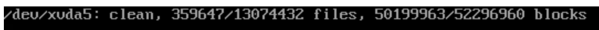
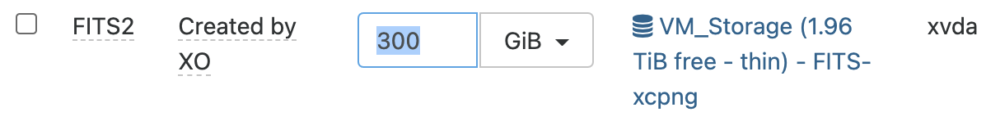
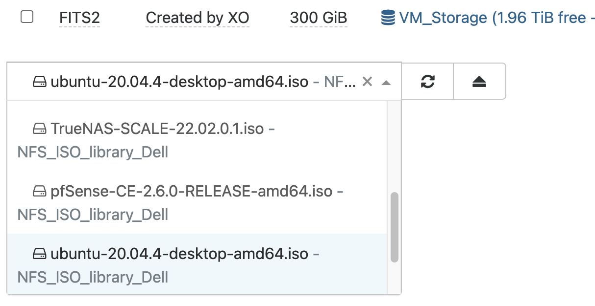
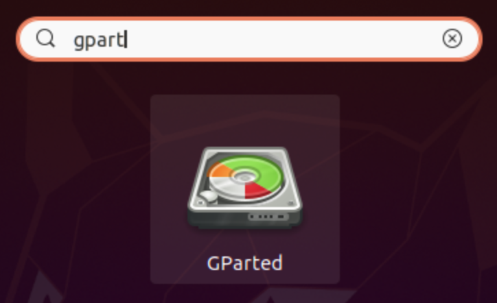
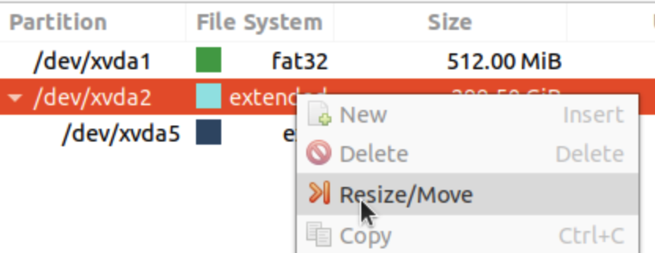
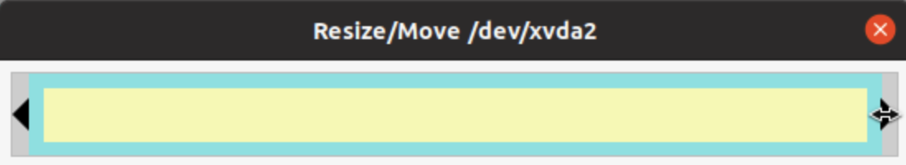
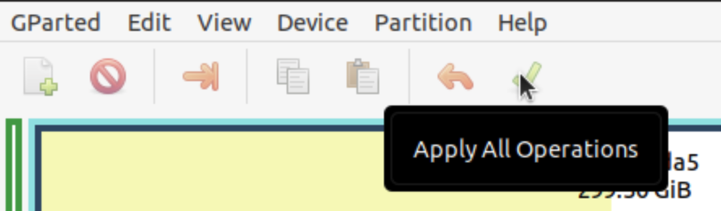

# FULL HARD DRIVE - UBUNTU FIX

## THE ISSUE UPON BOOT

<br><br>



<br><br>

DESCRIPTION OF THE PROBLEM:  A DDoS attack has caused MariaDB (MySql) to fill the hard drive with transaction logs.  Although this can be solved through configurations, access to the OS is impossible upon boot.  

<br><br>

Before proceeding, create a copy of your VM (recommend full copy if you have the space)

<br><br>

## STEP 1: Resize Hard Drive

<br><br>

My environment will be an XCP-ng Hypervisor using a hard drive with an original size of 200GB.  Using Xen Orchestra, a web interface for XCP-ng, the hard drive will be expanded to 300GB to enable restoration (or optional rebuild) of the Ubuntu Web Server.

<br><br>

(Make sure you shut down your VM before proceeding)
```
XEN --> HOME --> VMs --> change filter to NONE
```

<br><br>

Select your backup copy of the paralyzed VM <br>

```
VM --> DISKS TAB --> SIZE --> Change value to add space
```
NOTE:  The OS will not recognize this change immediately.

<br><br>



<br><br>

## STEP 2:  Boot into Ubuntu Live CD

<br><br>

[DOWNLOAD](https://ubuntu.com/download/desktop) - Ubuntu OS Download Link

<br><br>

The .img file can be added to the boot sequence of your VM.  You will need to add this image file to your ISO repository within XCP-ng (procedure not in scope of this tutorial).

<br><br>

```
VM --> ADVANCED TAB --> BOOT ORDER --> Place DVD-Drive in first position
VM --> DISKS TAB --> DVD-Drive --> Select ISO image from library
```

<br><br>



<br><br>

Now boot the image using the Play button in XCP-ng, and when prompted, select 'Try Ubuntu'

<br><br>

## STEP 3:  Resize Disk

<br><br>

Inside of the Ubuntu Live CD, use 'gparted' to resize your hard drive.  This program is a GUI, and can be accessed using the 'Show Applications' button on the bottom left of the screen.  Once clicked, type in 'gpart' to see the program present itself automatically.  Simply click on the program's icon to start it.

<br><br>



<br><br>

The program will list both the 'extended' and the 'ext4' partitions.  Both will be resized to the new value allowed by your selection in Step 1.

<br><br>

RIGHT CLICK:  on the 'extended' partition, right click and select 'Resize/Move' to see a new window pop-up.  Within this new window, you can now slide the right side of the box to your intended size.  The same will be done for the 'ext4' partition.

<br><br>



<br><br>



<br><br>

Each time you resize, you can click 'Resize/Move' on the pop-up window to commit your changes. <br>
NOTE:  Changes do not take effect until you select 'Apply All Operations'

<br><br>

Now click on the green check-mark at the top of the application called 'Apply All Operations'

<br><br>



<br><br>

The computer will now take a moment to resize your hard drive.  No data will be touched during this operation, only the partition size limitations.  A safe boot should be possible following this operation.  

<br><br>

At this time, simply shut down your VM before proceeding.

<br><br>

## STEP 4:  Change the Boot Order, and Boot

<br><br>

Referring to Step 2, change the boot order once again to place DVD-Drive into the second position, and Hard-Drive into the first.  After this is accomplished, you can then boot safely into your original installation of Ubuntu OS (or any other) to accomplish your backup tasks.
