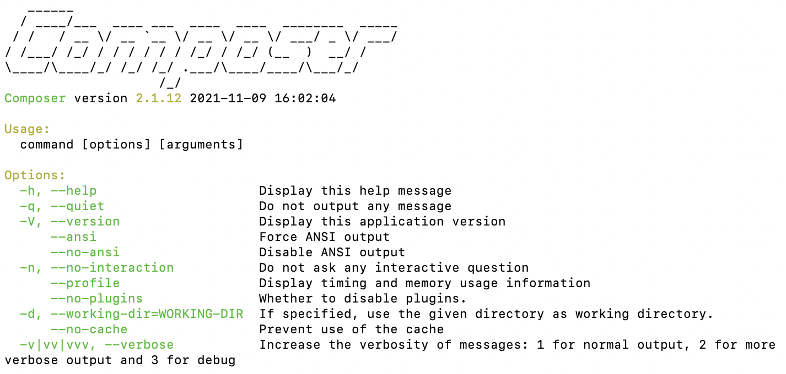

# INSTALLING YII FRAMEWORK ON MAMP
This tutorial assumes you have already installed MAMP on your Mac.
<br>
Database, website directories, and ports are already established.

## Using a MacBook Pro

### INSTALL COMPOSER
In a terminal window
<br>
navigate to where you would like to download Composer
<br>
...I use ~/Downloads/Composer
<br>
If you don't have that directory, just create it.
<br>
Type: curl -s http://getcomposer.org/installer | php
<br>

```
curl -s http://getcomposer.org/installer | php
All settings correct for using Composer
Downloading...

Composer (version 2.1.12) successfully installed to: /Users/development/Composer/composer.phar
Use it: php composer.phar
```

<hr>

### GIVE CLI ACCESS TO COMPOSER
By default, Macs don't have a /usr/local/bin folder available...
...so just make one
```
cd /usr/local
sudo mkdir bin
```
<br>
Now navigate to where you downloaded composer...
<br>
and copy composer to /usr/local/bin/composer
<br>

```
cd ~/Downloads/Composer
sudo cp composer.phar /usr/local/bin/composer
```

<hr>

### CHECK COMPOSER - did it install correctly?
shows the man page for Composer
<br>
Simply type composer into the terminal...
<!-- 

-->
<br>

<br>

<hr>

### CREATE NEW PROJECT - use Composer
In a terminal window
<br>
get to where you'd like your root directory to reside.
<br>
For me, it was:
<br>
/Users/development/Sites/
<br>
...in other words, all my development websites will go in the folder 'Sites'
<br>
Now type: composer create-project --prefer-dist yiisoft/yii2-app-advanced yiip2
<br>
...where yiip2 can be changed to any name for your project.

```
composer create-project --prefer-dist yiisoft/yii2-app-advanced yiip2
Creating a "yiisoft/yii2-app-advanced" project at "./yiip2"
Installing yiisoft/yii2-app-advanced (2.0.43)
  - Installing yiisoft/yii2-app-advanced (2.0.43): Extracting archive
Created project in /Users/development/Sites/yiip2
Loading composer repositories with package information
Updating dependencies
Lock file operations: 85 installs, 0 updates, 0 removals
```

<hr>

### PHP INIT - start your website
In a terminal window
<br>
Use 'php init' to gt the website started
<br>
this will automatically take care of yii requirements
<br>
Enter into your application directory and:
<br>
type 'php init'
<br>

```
php init
Yii Application Initialization Tool v1.0

Which environment do you want the application to be initialized in?

  [0] Development
  [1] Production

  Your choice [0-1, or "q" to quit] 0

  Initialize the application under 'Development' environment? [yes|no] yes
```

<hr>

### CREATE A DATABASE
this can be done with phpMyAdmin through MAMP
<br>
OR
<br>
you can create it through mysql commands
<br>
for phpMyAdmin, just use the GUI, and click 'new'
<br>
for CLI, use:
<br>
create database yiip2;
<br>
Then do the same to grant privileges.
<br>
To do a two-step user creation and privilege grant, use this:
<br>

```
CREATE USER 'user'@'%' IDENTIFIED WITH mysql_native_password BY 'password';
GRANT ALL ON database.* TO 'user'@'%';
FLUSH PRIVILEGES;
```

<br>
If you're in CLI, you may need an exit statement to leave MySQL.
<br>

```
EXIT;
```

<hr>

### DATABASE CONFIG - main-local.php (database config)
Mac needs a socket for MySQL... 
<br>
you can add that, and the MAMP port to 
<br>
{app directory}/common/config/main-local.php
<br>
For me, the {app directory} is the one described above
<br>
"/Users/development/Sites/"
<br>

```
'db' => [
            'class' => 'yii\db\Connection',
            // changed from localhost to 127.0.0.1
            'dsn' => 'mysql:host=localhost;port=8889;dbname=yiip2;unix_socket=/Applications/MAMP/tmp/mysql/mysql.sock',
            'username' => 'admin',
            'password' => 'adminadmin',
            'charset' => 'utf8',
        ],
```

<hr>

## YII MIGRATE - use to finalize your Yii framework
From within your app's root directory,
<br>
type: ./yii migrate

```
./yii migrate
Yii Migration Tool (based on Yii v2.0.43)

Creating migration history table "migration"...Done.
Total 2 new migrations to be applied:
	m130524_201442_init
	m190124_110200_add_verification_token_column_to_user_table

Apply the above migrations? (yes|no) [no]:yes
*** applying m130524_201442_init
    > create table {{%user}} ... done (time: 0.028s)
*** applied m130524_201442_init (time: 0.030s)

*** applying m190124_110200_add_verification_token_column_to_user_table
    > add column verification_token string NULL DEFAULT NULL to table {{%user}} ... done (time: 0.032s)
*** applied m190124_110200_add_verification_token_column_to_user_table (time: 0.033s)


2 migrations were applied.

Migrated up successfully.
```

<br>
If the migration was successful...
<br>
you will see two new tables in your database
<br>
1. Migration <br>
2. User <br>

<hr>

### EXAMPLE MIGRATE ERROR 1 - MySQL Connection Refused
In a terminal window
<br>
navigate to your project's base directory
<br>
For me, the {app directory} is the one described above
<br>
"/Users/development/Sites/yiip2"
<br>
type './yii migrate'
<br>
If the configuration is incorrect from the previous step, an error will show
<br>
This is from an invalid Port entry listed above
<br>

```
./yii migrate
Yii Migration Tool (based on Yii v2.0.43)

Exception 'yii\db\Exception' with message 'SQLSTATE[HY000] [2002] Connection refused'

in /Users/development/Sites/yiip2/vendor/yiisoft/yii2/db/Connection.php:649

Error Info:
Array
(
    [0] => HY000
    [1] => 2002
    [2] => Connection refused
)
```


### EXAMPLE MIGRATE ERROR 2 - MySQL no such file or directory
In a terminal window
<br>
This error will show if you haven't included the socket information above:
<br>

```
./yii migrate
Yii Migration Tool (based on Yii v2.0.43)

Exception 'yii\db\Exception' with message 'SQLSTATE[HY000] [2002] No such file or directory'

in /Users/development/Sites/yiip2/vendor/yiisoft/yii2/db/Connection.php:649

Error Info:
Array
(
    [0] => HY000
    [1] => 2002
    [2] => No such file or directory
)
```


### EXAMPLE MIGRATE ERROR 3 - MySQL access denied with password
In a terminal window
<br>

```
./yii migrate
Yii Migration Tool (based on Yii v2.0.43)

Exception 'yii\db\Exception' with message 'SQLSTATE[HY000] [1045] Access denied for user 'admin'@'localhost' (using password: YES)'

in /Users/development/Sites/yiip2/vendor/yiisoft/yii2/db/Connection.php:649

Error Info:
Array
(
    [0] => HY000
    [1] => 1045
    [2] => Access denied for user 'admin'@'localhost' (using password: YES)
)
```

### MIGRATION SUCCESSFUL - if there were no errors like the ones above


